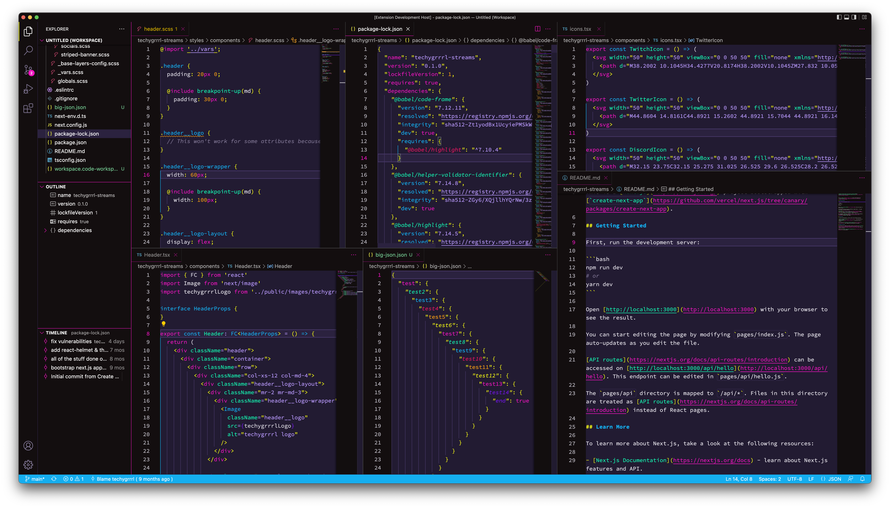

<h1 align="center">CMYK colourrrs</h1>

  

  <strong>CMYK colourrrs</strong> for Visual Studio Code is colour theme with both dark and light variants.

## Usage

1. Press F5 to start the development environment

## Screenshots

### Dark

#### JavaScript, HTML, CSS

#### Terminal

### Light

#### JavaScript, HTML, CSS

#### Terminal

